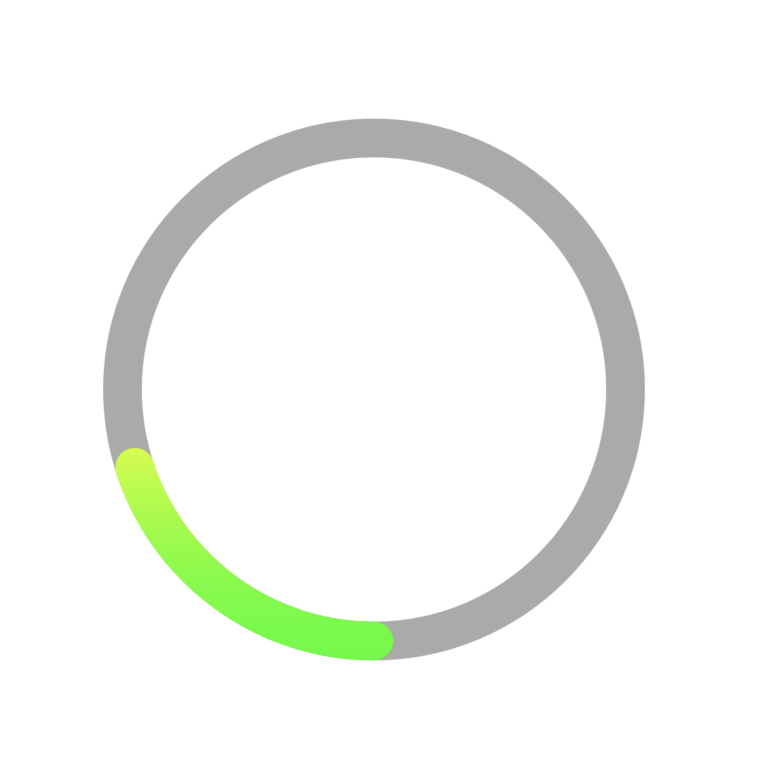

## A simple circular progress bar written in Swift


### Preview




### How to user

```
let progressBar = CircularProgressBar()
progressBar.lineCap = .round
progressBar.trackColor = UIColor.lightGray
progressBar.startAngle = 90.0
progressBar.progress = 0.2
progressBar.clockwise = true
progressBar.lineWidth = 20
progressBar.gradientColors = [UIColor.red.cgColor, UIColor.yellow.cgColor, UIColor.green.cgColor]
progressBar.backgroundColor = .white
view.addSubview(progressBar)
progressBar.snp.makeConstraints { make in
    make.width.height.equalTo(300)
    make.center.equalToSuperview()
}
```

